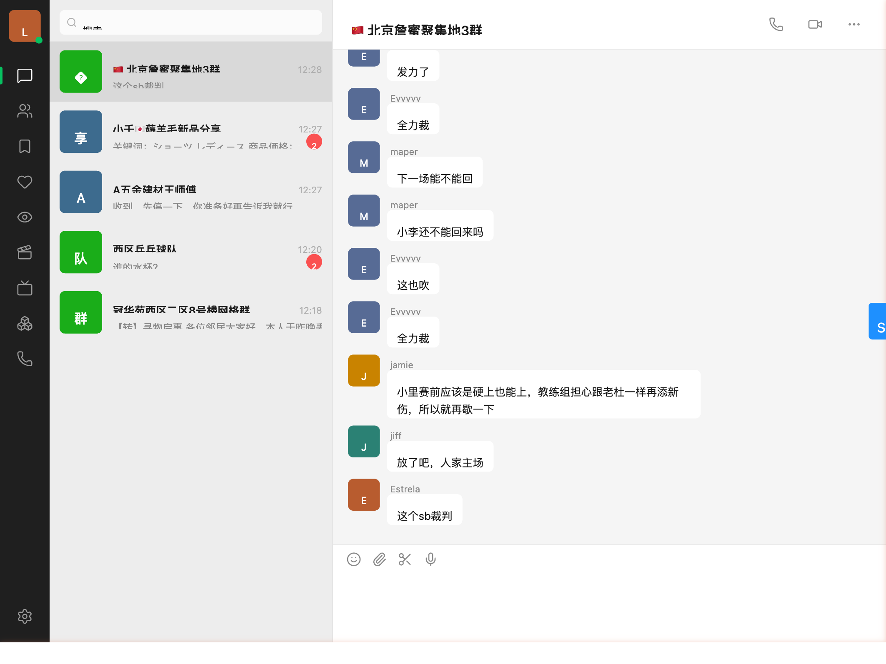

# wechat-skill-web-demo

A WeChat-clone web UI that talks to the
[`wechat-skill`](https://github.com/leeguooooo/wechat-skill) gateway through the
official **wechaty SDK** (`wechaty` + `wechaty-puppet-service`). Drop-in
starting point for any wechaty bot author who wants a browser UI on top of the
skill.



> Dev-only. Binds to `127.0.0.1` and has no auth. Put behind a reverse proxy
> with real auth before exposing it.

## Architecture

```
Browser (Svelte 5 SPA + Tailwind, vite dev server on :5173)
    │  fetch /api/*  ──┐
    │  WebSocket /ws ──┤  (vite proxy)
    ▼                  ▼
Node server (express + ws, :8787)
    │
    │  uses npm `wechaty` + `wechaty-puppet-service`
    ▼
wechat-wechaty-gateway (gRPC on 127.0.0.1:18401, managed separately)
    ▼
WeChat (macOS, run by the parent project)
```

The browser **never** speaks gRPC. The Node process is just a normal wechaty
bot that happens to publish its events to a websocket.

## How to run

1. Make sure your `wechat-wechaty-gateway` is up on `127.0.0.1:18401`.
2. `npm install`
3. `npm run dev`  *(starts vite on :5173 + node server on :8787)*
4. Open http://127.0.0.1:5173 in a browser.
5. The header should switch from "connecting…" to "logged in as <your name>".

## What it does

- **NavRail (left)**: dark macOS-WeChat-style rail with chat / contacts /
  favorites / moments / 看一看 / 视频号 / 直播 / 小程序 / 手机 / settings.
  Avatar at top with a colored status dot.
- **Sessions panel**: recent chats sorted by last activity, with unread badge,
  last-message preview (≤30 chars), 48px rounded avatar. Unified rounded
  search pill at top.
- **Chat thread (right)**: header shows topic + member count `(N)` for
  groups; messages render with avatar + sender name above each inbound
  bubble; self-sent bubbles right-aligned green (`#95EC69`); time dividers
  every 5 min in WeChat style (`昨天 20:15` / `周一 11:32`).
- **Image messages**: rendered as thumbnails
  (`Message.toImage().thumbnail()`), cached in an LRU of 100 entries on
  the server, lazy-loaded when scrolled into view (IntersectionObserver).
- **Live updates**: server fans out wechaty `message` events over WebSocket.
- **Send box**: `Enter` sends. Optimistic local rendering, reconciled when
  the wechaty echo comes back.
- **Persistence**: sessions + last 50 messages per thread are written to
  `~/.wechat-skill-web-demo/sessions.json` (debounced 5 s), so the sidebar
  populates within ms on next launch — wechaty puppet is intentionally
  push-only, so we accumulate state ourselves.

## Configuration

Environment variables (all optional):

| Var | Default | Meaning |
|---|---|---|
| `WECHATY_ENDPOINT` | `127.0.0.1:18401` | Gateway gRPC address (`host:port`). Alias: `WECHATY_GATEWAY_ENDPOINT`. |
| `WECHATY_TOKEN`    | `puppet_workpro_local` | Puppet token (placeholder; gateway doesn't enforce). Alias: `WECHATY_GATEWAY_TOKEN`. |
| `WECHATY_TLS_DISABLE` | `true` | Set to `false` to enable TLS on the gRPC connection. |
| `PORT`             | `8787`            | Local Node server port. |

## Scripts

| Command | Purpose |
|---|---|
| `npm run dev` | Vite dev server + tsx-watched server. |
| `npm run build` | Build static client to `dist/` and compile server to `dist-server/`. |
| `npm start` | Run the compiled server (serves nothing static — pair with a static host or extend `index.ts`). |
| `npm run typecheck` | `tsc --noEmit` for both client and server projects. |

## Build your own bot on top

Because the Node server is just a normal wechaty client, you can fork this repo
and replace the WebSocket fan-out with your bot logic. The full wechaty API is
available — `wechaty.on('message', …)`, `room.say(…)`, `contact.say(…)`, etc.

```ts
import { getWechaty } from './src/server/wechaty.js';
const wechaty = await getWechaty();
wechaty.on('message', async (msg) => {
  if (msg.text() === 'ping') await msg.say('pong');
});
```

That's the whole point of going through the wechaty protocol: any of the
hundreds of existing wechaty plugins / examples works against `wechat-skill`
unmodified.

## 远程部署（用户自托管）

v1.11 之后 `wechat-skill` 支持通过 Cloudflare Tunnel 把本机微信暴露给远程服务。
不过这对 web-demo 有一个**重要限制**，必须如实说明：

### v1.11 暴露的是 REST 桥，不是 gRPC

| 接口 | 本地地址 | v1.11 是否通过 Tunnel 对外暴露 |
|---|---|---|
| gRPC puppet gateway | `127.0.0.1:18401` | **否**（留 v1.12） |
| REST 桥 | `127.0.0.1:18402` | **是** |

web-demo 的 Node server 用的是 `wechaty-puppet-service`（gRPC 协议），  
而 v1.11 的 Cloudflare Tunnel 只暴露 REST 桥。  
因此 **v1.11 阶段，web-demo 远程部署只能跟 Mac 同 LAN**（直连 `<mac-ip>:18401`）；  
公网远程接入需等 **v1.12**（gRPC-over-Tunnel + grpc-web 支持）。

### 同 LAN 部署步骤（VPS / 树莓派 / 家庭服务器）

如果你的 web-demo 服务器和 Mac 在同一局域网（或通过 Tailscale 互通），  
只需设置以下环境变量指向 Mac 的 IP：

```bash
# Mac 本机 IP（System Settings → Network 查看，或 ip addr）
export WECHATY_ENDPOINT=192.168.1.10:18401
export WECHATY_TOKEN=puppet_workpro_local
export WECHATY_TLS_DISABLE=true

npm start
```

或者通过 `.env` 文件 / 部署平台（Render / Railway / Dokku）的环境变量面板设置。

### 环境变量参考

| 变量 | 默认值 | 说明 |
|---|---|---|
| `WECHATY_ENDPOINT` | `127.0.0.1:18401` | gRPC puppet gateway 地址（`host:port`） |
| `WECHATY_TOKEN` | `puppet_workpro_local` | Puppet token（占位符，gateway 不校验值） |
| `WECHATY_TLS_DISABLE` | `true` | 设为 `false` 启用 TLS（同 LAN 一般保持 `true`） |
| `PORT` | `8787` | Node server 监听端口 |

> 旧变量 `WECHATY_GATEWAY_ENDPOINT` / `WECHATY_GATEWAY_TOKEN` 仍被向后兼容识别，
> 但推荐迁移到新名称 `WECHATY_ENDPOINT` / `WECHATY_TOKEN`。

### 公网远程接入（v1.12 计划）

v1.12 会在 Cloudflare Tunnel 上同时暴露 gRPC-web，届时 web-demo 可以不依赖同 LAN
直接面向公网部署，配置只需改 `WECHATY_ENDPOINT` 指向 tunnel 地址。

---

## Roadmap (deferred for v2)

- Historical message backfill (wechaty puppet has no `listMessages` API; would
  require a non-standard `MessageHistory` RPC on the gateway that queries the
  daemon's SQLCipher DB)
- Sending images / files (gateway upload RPC unimplemented)
- Friend requests, room create / invite
- Message recall / forward / quote-reply
- Multi-account login
- Real auth + production deploy guide
- Voice playback
